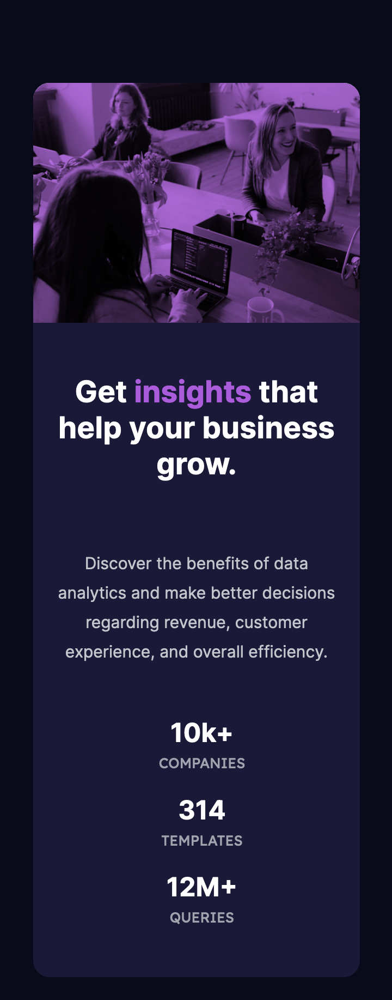

# Frontend Mentor - Stats preview card component solution

This is a solution to the [Stats preview card component challenge on Frontend Mentor](https://www.frontendmentor.io/challenges/stats-preview-card-component-8JqbgoU62). Frontend Mentor challenges help you improve your coding skills by building realistic projects. 

## Table of contents

- [Overview](#overview)
  - [The challenge](#the-challenge)
  - [Screenshot](#screenshot)
  - [Links](#links)
- [My process](#my-process)
  - [Built with](#built-with)
  - [What I learned](#what-i-learned)
  - [Continued development](#continued-development)
- [Author](#author)

## Overview

### The challenge

Users should be able to:

- View the optimal layout depending on their device's screen size

### Screenshot

### Links

- Solution URL: [https://github.com/ehwus/frontend-mentor/tree/main/stats-preview-card-component-main](https://github.com/ehwus/frontend-mentor/tree/main/stats-preview-card-component-main)
- Live Site URL: [https://friendly-easley-d52683.netlify.app/stats-preview-card-component-main/](https://friendly-easley-d52683.netlify.app/stats-preview-card-component-main/)

## My process

I identified the components necessary for the solution first:
- A card vertically and horizontally centred.
- 50% of the card would be the information, 50% the picture.
- The information card contains a title, a paragraph, and some statistics.

I then created the HTML elements for these particular items, and began to think about the styling.
I felt that this was a good case to use flex boxes, as this would give me a great deal of control over the
flow and spacing of each element. After the initial changes of font and colors to the style guide, I began placing everything
into a flex box appropriately, changing the order and flipping the card to be a column on mobile devices.

### Built with

- Semantic HTML5 markup
- CSS
- Flexbox

### What I learned

This was a good exercise in coding to a design brief given to me, which is not a luxury I'm afforded in my current day job!
I learned more about flexboxes, and how I can change the way they work depending on the given screen size.

### Continued development

I'd like to work on using semantic HTML markup to make my work more accessible, and custom CSS properties to make my CSS
cleaner and more reusable.

## Author

- Website - [Alex Withington-Smith](https://awithsmith.com/)
- Frontend Mentor - [@ehwus](https://www.frontendmentor.io/profile/ehwus)
- Twitter - [@awithsmith](https://twitter.com/awithsmith)

